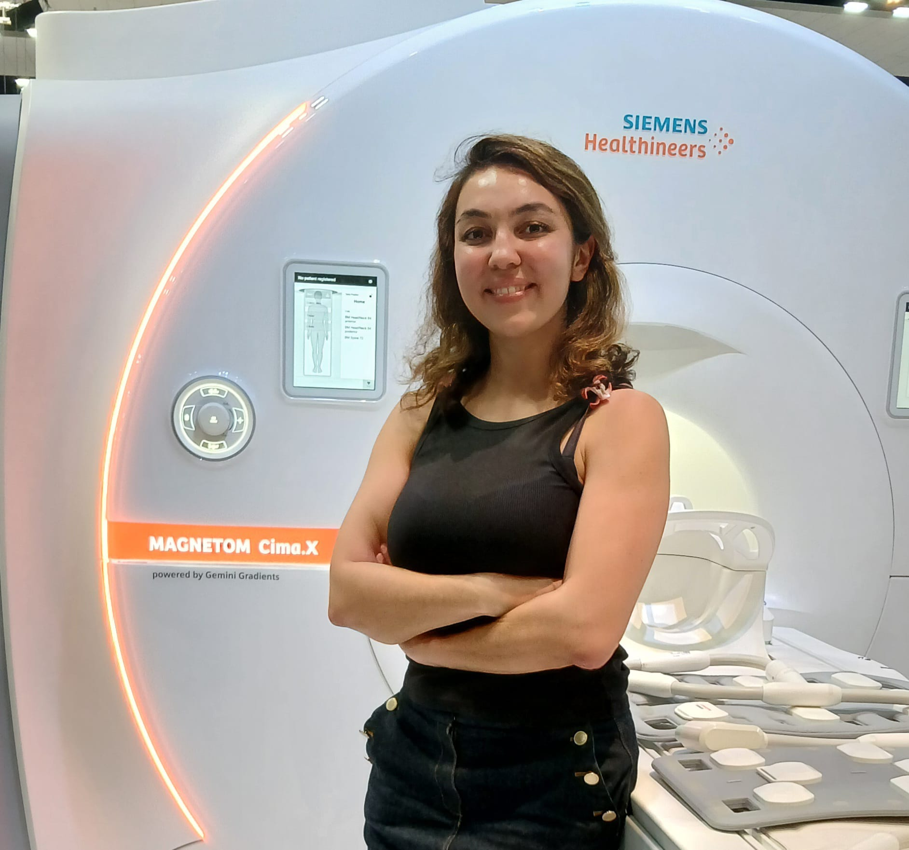

A Road Trip down Memory Lane: Making Maps of the Brain’s Pathways with Diffusion MRI

How can we create images of the pathways connecting different areas of the brain without touching it? Diffusion magnetic resonance imaging makes this possible! In this presentation we explain how this technology works and share beautiful images of the brain.

### Presenters and organizers

### Presenters and organizers


    <figure>
            
            
        <figcaption>
            <b>Tanja Schmidt</b>, Presenter. 
            <b>Iryna Vlasiuk</b>, Moderator.
        </figcaption>
    </figure>


Tanja Schmidt is a PhD candidate in Clinical Neurosciences at the University of Cambridge and a Gates Cambridge Scholar. Her research focuses on using quantitative MRI and computational models to improve diagnosis and understanding of neurodegenerative diseases in memory clinic populations.

Iryna Vlasiuk is a PhD candidate in Clinical Neurosciences at the University of Cambridge, working in Dr. Timothy Rittman's Neurodegeneration Informatics Laboratory. Her research investigates memory impairment and cognitive decline in neurodegenerative conditions, such as Progressive Supranuclear Palsy, combining behavioral assessment and neuroimaging to map regional brain changes

<!-- ### Official Trailer

#### English subtitles


<!-- ### The presentation

 
    <figure> 
            
            
            
            
            
        <figcaption>
            <b>Pictures from the presentation.</b>
        </figcaption>
    </figure>


From [Irene Balboni](https://twitter.com/irene_balboni/status/1656627725308657664?s=20). -->
