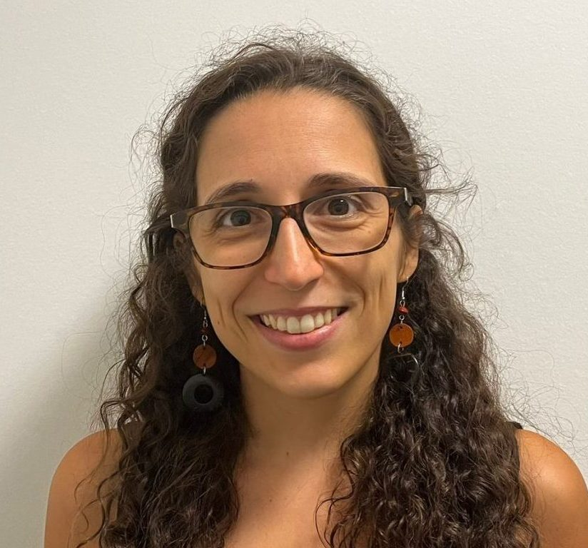
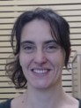
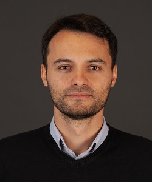

A aprendizagem de programação tem vários benefícios entre eles estímulo do raciocínio lógico, desafios constantes à criatividade, melhor aproveitamento do tempo dispensado nos dispositivos digitais. Contudo, qual é o impacto desta atividade no desenvolvimento do cérebro das crianças? Qual é o efeito da introdução da programação nos programas escolares nas capacidades cognitivas das crianças? Qual o seu impacto no desempenho escolar nas áreas da matemática e linguística? Ocorrem alterações morfológicas e funcionais cerebrais associadas a aprendizagem da programação no ensino básico?

Neste projeto pretende-se investigar a relação entre o ensino da linguagem de programação Scratch e a capacidade de resolução de problemas de alunos que começam a aprender programação no ensino básico, recorrendo a técnicas de neuroimagem e avaliação neuropsicológica.

Se quiser saber mais, pode assistir o vídeo da nossa palestra: A aprendizagem da programação e o seu impacto no neurodesenvolvimento organizada por *OHBM Brain Mappers of Tomorrow 2024*. Aproveitem!

### Learning programming and their impact on neurodevelopment

Programming has many benefits, including stimulating logical thinking, constantly challenging creativity and making better use of the time spent on digital devices. However, what is the impact of this activity on children's brain development? What is the effect of introducing programming into school programs on children's cognitive abilities? What impact does it have on school performance in the areas of mathematics and linguistics? Are there morphological and functional brain changes associated with learning programming in elementary school?

The aim of this project is to investigate the relationship between the teaching of the Scratch programming language and the problem-solving skills of students who start learning programming in elementary school, using neuroimaging techniques and neuropsychological assessment.

If you want to know more, you can watch the video of our talk: Learning programming and its impact on neurodevelopment organized by OHBM Brain Mappers of Tomorrow 2024. Enjoy!

<!-- **[Registration is closed](https://docs.google.com/forms/d/e/1FAIpQLScSGwVp4u_BmJPfdx6EiwFffblTmG53RnQpQwb4B3_sg4XZYA/viewform?usp=sf_link)** -->

### Presenters and organizers


    <figure>
        <!-- <figure> -->
            
        <figcaption>
            <b>Rita Oliveira </b>, Presenter.
        </figcaption>
    </figure>


Rita Oliveira is a Post-doctoral research fellow at the Microstructure Mapping Laboratory, Department of Radiology, CHUV/Université de Lausanne. 


    <figure>
        <!-- <figure> -->
            
        <figcaption>
            <b>Giulia di Domenticantonio </b>, Moderator.
        </figcaption>
    </figure>


Giulia Di Domenticantonio is a researcher at the  In Vivo Imaging Facility, CHUV/Université de Lausanne.


    <figure>
        <!-- <figure> -->
            
        <figcaption>
            <b>Joāo Jorge </b>, Moderator.
        </figcaption>
    </figure>


Joāo Jorge is an SNSF Ambizione Research Fellow at the Swiss Center for Electronics and Microtechnology at the Université de Lausanne.
<!-- ### Official Trailer

#### English subtitles


#### Italian subtitles
 -->

<!-- ### The presentation

 
    <figure> 
            
            
            
            
            
        <figcaption>
            <b>Pictures from the presentation.</b>
        </figcaption>
    </figure>


From [Irene Balboni](https://twitter.com/irene_balboni/status/1656627725308657664?s=20). -->
